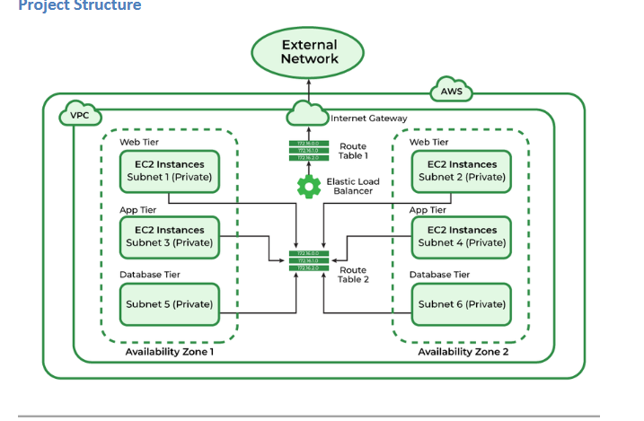

# CloudFlix Architecture

## Project Overview

CloudFlix is a full-stack movie discovery platform designed to demonstrate modern cloud infrastructure, networking, and application deployment on Amazon Web Services (AWS). The application enables users to discover movies through The Movie Database (TMDB), create accounts, maintain personal watchlists, publish movie reviews, and generate AI-powered summaries that combine community reviews from both CloudFlix and TMDB.

The platform was built using a multi-tier architecture consisting of Apache frontend servers, Flask backend APIs, and a MariaDB database deployed across multiple Availability Zones. Supporting AWS services such as an Application Load Balancer, CloudWatch Logs, Amazon S3, and Cloudflare DNS were integrated to improve scalability, monitoring, and operational reliability.

---

## Project Status

CloudFlix was completed as part of a cloud infrastructure course (IT342: Cloud Administration) at the New Jersey Institute of Technology (NJIT). The AWS environment has since been decommissioned to prevent ongoing cloud costs, but this repository preserves the application's architecture, implementation details, and engineering decisions.

The documentation below provides an overview of the infrastructure, networking, security, monitoring, and application design used throughout the project.

# CloudFlix Architecture

## 1. Architecture Overview

CloudFlix was deployed as a multi-tier web application on Amazon Web Services across two Availability Zones. The environment separated frontend, backend, and database resources into dedicated network tiers.

The architecture was designed to demonstrate:

* Multi-Availability Zone deployment
* Network segmentation
* Load-balanced application delivery
* Path-based request routing
* Private backend and database connectivity
* Health monitoring
* Centralized application and web-server logging

> The AWS resources used for the project were later removed to prevent ongoing cloud charges. This document preserves the architecture and implementation decisions from the completed deployment.



---

## 2. High-Level Request Flow

A typical request followed this path:

```text
User
  |
  v
Custom Domain / Application URL
  |
  v
Internet-Facing Application Load Balancer
  |
  +-- Frontend requests ----------> Frontend Target Group
  |                                  |
  |                                  +-- Frontend EC2 in AZ 1
  |                                  +-- Frontend EC2 in AZ 2
  |
  +-- API and authentication -----> Backend Target Group
                                     |
                                     +-- Flask EC2 in AZ 1
                                     +-- Flask EC2 in AZ 2
                                              |
                                              v
                                        MariaDB Database
```

The Application Load Balancer provided a single entry point for the application and routed requests to the correct application tier.

---

## 3. VPC and Subnet Design

CloudFlix used a custom VPC with six subnets distributed across two Availability Zones.

### Subnet layout

| Tier              | Availability Zone 1 | Availability Zone 2 |
| ----------------- | ------------------- | ------------------- |
| Public / Frontend | Public Subnet 1     | Public Subnet 2     |
| Backend           | Backend Subnet A    | Backend Subnet B    |
| Database          | Database Subnet A   | Database Subnet B   |

This design separated internet-facing resources from application and database resources.

### Public tier

The public subnets hosted the internet-facing Application Load Balancer and frontend resources.

The VPC used an Internet Gateway to provide internet connectivity to resources that required public access.

### Backend tier

The backend subnets hosted the Flask application servers.

Backend application traffic entered through the Application Load Balancer rather than through direct public access.

### Database tier

The database tier hosted MariaDB and was not intended to accept traffic directly from the internet.

Database access was limited to the backend application tier.

---

## 4. Application Load Balancer

CloudFlix used one internet-facing Application Load Balancer across both Availability Zones.

A two-load-balancer design was considered:

* One public ALB for the frontend
* One internal ALB for the backend

The final implementation used one public ALB with path-based routing. This reduced infrastructure cost and allowed frontend and backend requests to use the same application origin.

### Listener configuration

The ALB accepted web traffic and forwarded requests to separate target groups.

* Frontend target group: HTTP port 80
* Backend target group: Flask port 5000
* Frontend health check: `/`
* Backend health check: `/health`

### Path-based routing

Requests for application APIs and authentication were forwarded to the backend target group.

Example backend paths included:

```text
/login
/register
/me
/logout
/health
/api/*
```

All remaining requests were forwarded to the frontend target group.


## Using relative frontend API paths allowed requests to pass through the ALB rather than relying on hardcoded public EC2 addresses.

## 5. Frontend Tier

The frontend tier served the CloudFlix user interface from EC2 instances distributed across both Availability Zones.

The interface included pages for:

* Movie discovery
* Movie details
* Login and registration
* User profiles
* Personal watchlists
* User reviews

Apache HTTP Server was used to serve frontend content. Apache access and error logs were collected for centralized monitoring.

Multiple frontend instances reduced dependence on a single server and allowed the Application Load Balancer to distribute requests between Availability Zones.

---

## 6. Backend Tier

The backend consisted of Flask application servers running on EC2.

The Flask API supported:

* User registration and login
* Session-based authentication
* User and administrator roles
* Movie search and discovery
* TMDB API proxy routes
* User reviews
* Personal watchlists
* AI-generated review summaries
* Load balancer health checks

The backend exposed a `/health` route that returned an HTTP 200 response for target-group health monitoring. It also included a `/whoami` route that returned the hostname of the responding server, allowing load distribution across backend instances to be tested.

---

## 7. Database Tier

CloudFlix used MariaDB for persistent application data.

The database stored information such as:

* User accounts
* Password hashes
* User roles
* Movie reviews
* Watchlist entries
* Cached AI-generated summaries

The Flask backend connected to MariaDB using PyMySQL.

Database traffic was restricted to the backend application tier. The database was not designed to receive direct public internet traffic.

---

## 8. Security Group Design

Security groups enforced communication between the application tiers.

### ALB security group

The ALB security group accepted public web traffic on:

* HTTP port 80
* HTTPS port 443, when configured

### Frontend security group

Frontend HTTP access was restricted to traffic originating from the ALB security group rather than being open directly to the internet.

### Backend security group

The backend accepted Flask application traffic only from the ALB security group on port 5000.

### Database security group

MariaDB accepted database connections only from the backend security group.

This created the following trust flow:

```text
Internet
   |
   v
ALB Security Group
   |
   +--> Frontend Security Group
   |
   +--> Backend Security Group
              |
              v
       Database Security Group
```

The recovered configuration notes specifically document restricting frontend and backend access to the ALB security group and restricting MariaDB access to the backend tier.

---

## 9. Authentication and Application Security

CloudFlix used server-side Flask sessions for authentication.

The backend implemented:

* Password hashing with bcrypt
* Session-based login state
* HTTP-only session cookies
* Input validation
* Parameterized SQL queries
* User and administrator authorization
* Ownership checks for review updates and deletion

Regular users could manage only their own watchlists and reviews. Administrators could moderate reviews but were not given unrestricted access to private user watchlists.
Secrets such as database credentials, Flask secret keys, and API keys should be loaded through environment variables or AWS Secrets Manager in a production deployment.

---

## 10. External API Integration

The Flask backend acted as a proxy between the frontend and The Movie Database API.

Supported operations included:

* Trending movies
* Movie discovery and filtering
* Search by title
* Movie details
* Cast and credits
* Release dates
* Trailers
* Streaming providers
* Recommendations

Using backend proxy endpoints kept the TMDB bearer token off the client and centralized request handling.

---

## 11. AI Review Summaries

CloudFlix included an OpenAI-powered review-summary feature.

The backend combined:

* Reviews written by CloudFlix users
* Public reviews retrieved through TMDB

It then generated a concise summary describing overall sentiment, common praise, and common criticism.

Generated summaries were stored in MariaDB so the application did not make a new model request on every page view.

## A summary was regenerated only after the number of available reviews increased by a defined threshold. If a new generation failed, the backend could return the previously cached summary.

## 12. Centralized Logging

Amazon CloudWatch was used to centralize logs from frontend and backend instances.

### Collected logs

The CloudWatch Agent collected:

* Flask application logs
* Apache access logs
* Apache error logs

Apache logs were collected from:

```text
/var/log/httpd/access_log
/var/log/httpd/error_log
```

Each EC2 instance used its instance ID as the CloudWatch log-stream name.

### Log groups

The recovered configuration documented three primary log groups:

| Log group                   | Purpose                                    |
| --------------------------- | ------------------------------------------ |
| `cloudflix-flask`           | Flask backend application logs             |
| `cloudflix-frontend-access` | Apache frontend request logs               |
| `cloudflix-frontend-error`  | Apache warnings, errors, and server events |

With two instances per application tier, the logging design produced multiple instance-specific streams and enabled centralized troubleshooting across Availability Zones.

### Operational value

Centralized logging made it possible to:

* Investigate application failures without connecting to every EC2 instance
* Compare behavior between instances
* Review HTTP request activity
* Search for Apache errors and critical events
* Confirm that traffic reached multiple servers
* Query logs through CloudWatch Logs Insights

A sample Logs Insights query used during testing was:

```text
fields @timestamp, @message
| sort @timestamp desc
| limit 20
```

---

## 13. High Availability

CloudFlix improved availability by distributing application resources across two Availability Zones.

High-availability components included:

* ALB nodes spanning two public subnets
* Multiple frontend instances
* Multiple backend instances
* Target-group health checks
* Traffic distribution across healthy targets
* Centralized logging across application instances

The deployment did not rely on a single frontend or backend EC2 instance for all application traffic.

---

## 14. Design Trade-Offs

### One ALB instead of two

Using one ALB reduced cost and complexity but required path-based routing rules.

A larger production design could use:

* A public ALB for frontend traffic
* An internal ALB for backend services

### EC2-hosted MariaDB

Hosting MariaDB on EC2 provided direct control and supported the educational goals of the project.

A production deployment could use Amazon RDS or Aurora to gain:

* Automated backups
* Managed patching
* Multi-AZ database failover
* Improved monitoring
* Easier scaling

### Manual deployment

The recovered implementation relied primarily on manually configured AWS resources and EC2 deployments.

Future versions could use Terraform, AWS CloudFormation, or another Infrastructure as Code platform to make the environment reproducible.

---

## 15. Future Improvements

Potential improvements include:

* Provision the complete environment through Terraform
* Store secrets in AWS Secrets Manager or Systems Manager Parameter Store
* Enforce HTTPS with AWS Certificate Manager
* Set secure cookie flags after HTTPS is enabled
* Replace the EC2-hosted database with Amazon RDS
* Add Auto Scaling groups for frontend and backend instances
* Add CloudWatch alarms for unhealthy targets and application errors
* Add AWS WAF in front of the Application Load Balancer
* Add automated deployment through GitHub Actions
* Add database backup and recovery procedures
* Add formal load and failover testing

---

## 16. Skills Demonstrated

This project demonstrates experience with:

* AWS VPC architecture
* Multi-AZ subnet design
* Application Load Balancers
* Path-based routing
* EC2 deployment
* Security groups
* Internet Gateways and route tables
* Flask REST APIs
* MariaDB
* Authentication and authorization
* Third-party API integration
* CloudWatch Logs
* Operational troubleshooting
* High-availability design
* AI API integration and caching
